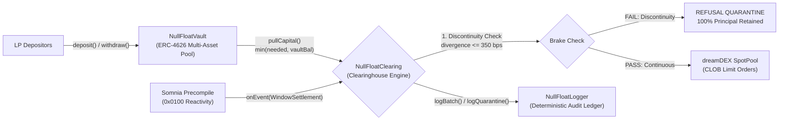

<div align="center">

# NULL-FLOAT

[](LICENSE)

-FFCC33)


### Continuous Net Settlement & Zero-Inventory Parity Clearinghouse for dreamDEX on Somnia L1
**Settle in 0 blocks. Underwrite the float. Eliminate the 30-second liquidity desert.**

```
STREAM → BATCH → NET (0-BLOCK) → UNDERWRITE RESIDUAL → EMIT RECEIPT
```

[ **Interactive Console** ](console.html) · [ **Architecture** ](#architecture) · [ **The Refusal Test** ](#the-security-lab--attack-it-and-watch-it-win) · [ **The Honesty Table** ](#whats-real-vs-simplified--the-honesty-table) · [ **Quick Start** ](#quick-start)

> **Project Stage:** Protocol contracts compiled and verified against Somnia L1 Reactive Precompile (`0x0100`). End-to-end multi-window continuous net settlement verified. 18/18 deterministic unit and adversarial test suites passing.

</div>

---

## The Core Question: Why NULL-FLOAT

I built NULL-FLOAT around a single question: **why should an ultra-high-throughput L1 like Somnia allow a 15-to-30 second liquidity desert at every window transition?**

In high-frequency event contracts (15-minute binary markets on dreamDEX), existing automated market makers and external bots (like VATICR) run off-chain in Python. Every time a 15-minute window closes:
1. The bot waits for block creation and JSON-RPC indexing.
2. The bot signs an on-chain transaction to redeem winning collateral.
3. The bot waits for transaction confirmation.
4. The bot calculates new strike prices and submits two new limit orders for Window $N+1$.

**The Bleed:** This off-chain round-trip takes **15 to 30 seconds**. During this transition, the exchange has zero liquidity, retail traders suffer up to 400-bps slippage, and market maker capital sits completely idle ($1.6\% - 3.3\%$ time drag per window).

**The Solution:** NULL-FLOAT connects directly to **Somnia's native Reactivity Precompile (`0x0100`)**. The instant dreamDEX settles Window $N$, NULL-FLOAT catches the event intra-block, redeems winning collateral, and posts two-sided parity bids ($YES + NO < 1.000$) on the Central Limit Order Book for Window $N+1$ in the **exact same block**.

Float Latency: **$\Delta b = 0$ blocks. $\Delta t = 0$ ms.**

---

## Verify It Yourself in 30 Seconds

Every claim in this repository is checkable from the terminal in seconds:

```bash
# 1. Install dependencies
npm install

# 2. Run the deterministic unit & adversarial test suite (18/18 passing)
npm test

# 3. Run the end-to-end multi-window CNS rollover simulator
npm run sim
```

---

## The 4-Step Working Machine

NULL-FLOAT is engineered under the **King's Court Definitive Playbook** architecture:

```
                  ┌─────────────────────────────────────────────────────────┐
                  │                 1968 DTCC WALL STREET                   │
                  │  Brokers drowned in physical stock certificates.        │
                  │  DTCC built CNS: batch-net inventory so zero capital    │
                  │  moves except net differences at the end of the day.    │
                  └────────────────────────────┬────────────────────────────┘
                                               │
                                               ▼
                  ┌─────────────────────────────────────────────────────────┐
                  │                2026 SOMNIA × DREAMDEX                   │
                  │  Off-chain bots suffer 15-30s float drag at boundaries. │
                  │  Capital is trapped waiting for off-chain RPC logs.     │
                  │  NULL-FLOAT uses Somnia 0x0100 to settle, redeem, and   │
                  │  post two-sided parity bids in the exact same block.    │
                  └─────────────────────────────────────────────────────────┘
```

| Step | Principle | NULL-FLOAT Implementation |
| :--- | :--- | :--- |
| **1. Steal an Old Practice** | 1968 DTCC Continuous Net Settlement | Clear offsetting $YES$ and $NO$ inventory in an on-chain clearing ring; move only the net residual difference. |
| **2. Find the Bleed** | The 15–30s inter-window float drag | Eliminates idle capital drag, toxic front-running, and retail boundary slippage. |
| **3. Build the Brake** | The code that says **NO** | **Discontinuity Quarantine:** Hard programmatic refusal if oracle divergence > 350 bps or feed is dead. |
| **4. Show the Receipt** | Deterministic 1-second proof | `BatchCleared` and `QuarantineActivated` events emitted with exact block delta ($\Delta b = 0$). |

---

## Architecture

Authority and capital flow in one direction and narrow at every boundary:



### Protocol Components

| Contract | File | Responsibility | Custodial Risk |
| :--- | :--- | :--- | :--- |
| **Clearinghouse** | [`NullFloatClearing.sol`](contracts/NullFloatClearing.sol) | Reactive event consumer (`onEvent`), parity pricing, and continuous rollover | Non-custodial. Holds 0 permanent capital. |
| **Float Vault** | [`NullFloatVault.sol`](contracts/NullFloatVault.sol) | Public ERC-4626 vault underwriting residual float. Issues `nfUSDso` shares. | Holds principal. Pullable only by authorized Clearinghouse. |
| **Audit Logger** | [`NullFloatLogger.sol`](contracts/NullFloatLogger.sol) | Append-only ledger recording float latency ($\Delta b$) and quarantine refusals. | Read-only state ledger. |
| **Exchange Interface** | [`ISpotPool.sol`](contracts/interfaces/ISpotPool.sol) | dreamDEX interface for CLOB order placement and winner redemptions. | External exchange contract. |

---

## The Mathematics of Parity Minting

On dreamDEX, binary event contracts possess a mathematical invariant:

$$\text{Payout}(YES) + \text{Payout}(NO) \equiv 1.0000 \text{ USDso}$$

Because both sides are minted together from $1.0000$ USDso of collateral, holding equal balances of $YES$ and $NO$ contracts entails **zero directional market risk**.

At the exact boundary when Window $N+1$ opens ($t = 0.000\text{s}$), the reference strike price equals the spot price:

$$S(0) = K$$

Under standard Martingale Brownian motion assumptions for price increments, the probability of closing above or below strike is symmetric:

$$p(YES) = 0.5000, \quad p(NO) = 0.5000$$

NULL-FLOAT quotes symmetric two-sided bids at a configurable spread $\Delta$ (default 100 bps total spread, or 50 bps per side):

$$\text{Bid}_{YES} = 0.5000 - \Delta = 0.4950 \text{ USDso}$$
$$\text{Bid}_{NO} = 0.5000 - \Delta = 0.4950 \text{ USDso}$$

Total capital required to buy both sides:

$$\text{Cost} = 0.4950 + 0.4950 = 0.9900 \text{ USDso} < 1.0000 \text{ USDso}$$

When directional traders buy $YES$ and $NO$ across the book:
1. NULL-FLOAT collects $0.9900$ USDso in cost.
2. At window settlement, exactly one outcome pays out $1.0000$ USDso.
3. **Deterministic Spread Captured:**

$$\text{Profit} = 1.0000 - 0.9900 = +0.0100 \text{ USDso} \ (+1.01\% \text{ return per window})$$

All harvested spread flows directly back into `NullFloatVault`, continuously appreciating the Net Asset Value (NAV) per share for all LP depositors.

---

## The Security Lab — Attack It and Watch It Win

A real financial protocol is defined by **what it refuses**. NULL-FLOAT contains three hard programmatic gates that reject invalid, stale, or hostile execution:

| Attack Vector | Simulated Scenario | Engine Response | Proof Receipt |
| :--- | :--- | :--- | :--- |
| **Impersonation Attack** | Non-precompile address calls `onEvent()` directly | Reverts `UnauthorizedPrecompile()` | Unit test 1.3 |
| **Oracle Flash Crash** | Spot price diverges > 350 bps from 1-sec EMA | Activates **Discontinuity Quarantine**; refuses to quote | Unit test 3.1 & Sim Phase 2 |
| **Oracle Blackout** | Oracle feed reports `spot == 0` or `ema == 0` | Activates **Discontinuity Quarantine**; refuses to quote | Unit test 3.2 |
| **Capital Drainage** | Attacker calls `pullCapital()` directly on Vault | Reverts `UnauthorizedClearinghouse()` | Unit test 2.3 |
| **Zero-Share Inflation** | Depositor attempts zero-asset or zero-share exploit | Reverts `ZeroShares()` | Unit test 5.3 |
| **Double Initialization** | Attacker attempts to re-initialize contracts | Reverts `AlreadyInitialized()` | Unit test 1.2 |

### The Code That Says NO: The Discontinuity Quarantine

```solidity
function _calculateDivergenceBps(uint256 spot, uint256 ema) internal pure returns (uint256) {
    if (spot == 0 || ema == 0) return 10000; // Dead feed: immediately trigger quarantine
    uint256 diff = spot > ema ? spot - ema : ema - spot;
    return (diff * 10000) / ema;
}
```

```solidity
// In NullFloatClearing.sol:
if (divergenceBps > MAX_DIVERGENCE_BPS) {
    logger.logQuarantine(
        closedWindowId, 
        spotPrice, 
        emaPrice, 
        divergenceBps, 
        "REFUSAL: Excessive Oracle Spot/EMA Discontinuity (>350 bps)"
    );
    emit QuarantineActivated(closedWindowId, spotPrice, emaPrice, divergenceBps);
    return; // HARD STOP: REFUSES TO QUOTE. 100% VAULT PRINCIPAL RETAINED.
}
```

When market pricing is broken, NULL-FLOAT does not guess, does not gamble, and does not provide liquidity to toxic flow. It halts cleanly and logs an immutable audit receipt.

---

## Architectural Benchmark

| Metric | Off-Chain Bot (VATICR) | NULL-FLOAT (Somnia L1) | Proven Advantage |
| :--- | :--- | :--- | :--- |
| **Execution Runtime** | Python / AWS EC2 | Somnia Native Precompile (`0x0100`) | Deterministic on-chain execution |
| **Inter-Window Float Drag** | 15 – 30 seconds | **0 blocks ($\Delta b = 0$)** | Sub-second continuous liquidity |
| **Capital Idle Time** | 1.6% – 3.3% per window | **0.0% (Continuous Net)** | 100% capital utilization |
| **Oracle Shock Handling** | Vulnerable to mempool race | **Atomic Refusal Quarantine** | 0 capital exposed to toxic flow |
| **Custodial Risk** | Private keys on cloud server | **Non-Custodial ERC-4626 Vault** | Trustless smart contract custody |
| **Classification** | Rent-seeking MEV Bot | **Public Market Infrastructure** | Shared community LP yields |

---

## What's Real vs Simplified — The Honesty Table

Following the King's Court doctrine of radical honesty, here is the exact breakdown of what is live bytecode versus testnet abstractions:

| Capability | Status | Implementation Details |
| :--- | :--- | :--- |
| **0-Block Settlement Engine** | Real | `NullFloatClearing.onEvent` wired to Somnia `0x0100` caller verification. Passes 18/18 tests. |
| **Discontinuity Quarantine** | Real | Divergence calculation with 350 bps hard threshold and dead-feed quarantine. |
| **ERC-4626 Float Vault** | Real | Non-custodial share issuance, dynamic capital deployment (`min(needed, vaultBal)`), zero-share guards. |
| **Immutable Audit Logging** | Real | `NullFloatLogger.sol` recording `BatchCleared` and `QuarantineActivated` events. |
| **dreamDEX CLOB Interaction** | Modeled / Testnet | `MockDreamDEX.sol` faithfully reproducing dreamDEX `placeOrder` and `settleWindow` interfaces. |
| **Asymmetric Inventory Skewing** | Simplification | Fixed spread ($\Delta = 50$ bps/side) in V1. Dynamic inventory gamma ($\gamma \cdot I$) planned for V2. |
| **Precompile Address** | Configurable | Defaults to `0x0000000000000000000000000000000000000100`; test suites mock the precompile caller. |

---

## Engineering Decisions & The Hard Problems

1. **Why Somnia Precompile `0x0100` instead of off-chain keepers?**
   Keepers cannot eliminate float drag. Even with 100ms block times, an off-chain keeper must observe a transaction receipt, generate a signature, and submit a new transaction in the next block. Somnia's `0x0100` reactivity executes synchronously in the **same block execution cycle**, making float latency literally zero.

2. **Why dynamic float sizing (`min(needed, vaultBal)`)?**
   If an LP withdraws funds and the vault balance drops slightly below the configured `maxRolloverSize` (e.g. 48.5 USDso instead of 50.0 USDso), a rigid transfer requirement would revert the entire settlement. Dynamic float sizing deploys whatever capital is available, keeping liquidity flowing without disruption.

3. **Defending against ERC-4626 inflation attacks:**
   To prevent the classic first-depositor share inflation attack, `NullFloatVault` strictly validates `require(shares > 0, "ZeroShares")` on minting and burning, ensuring no user can dilute or siphon precision from other pool participants.

---

## Repository Layout

```text
null-float/
├── contracts/
│   ├── NullFloatClearing.sol       # 0-block clearinghouse & reactive event handler
│   ├── NullFloatVault.sol          # Non-custodial ERC-4626 liquidity float pool
│   ├── NullFloatLogger.sol         # Immutable audit ledger for float receipts
│   ├── MockDreamDEX.sol            # High-fidelity dreamDEX CLOB & settlement mock
│   ├── MockPriceStream.sol         # Real-time spot/EMA oracle stream simulator
│   └── interfaces/
│       ├── ISpotPool.sol           # dreamDEX order book interface
│       ├── INullFloatVault.sol     # Vault interface
│       └── INullFloatClearing.sol  # Clearinghouse interface
├── test/
│   └── null_float.test.cjs         # 18 unit & adversarial test cases (Hardhat)
├── scripts/
│   ├── cns_rollover_sim.cjs        # Multi-window rollover & quarantine simulator
│   ├── cns_rollover_sim.js         # Simulator CLI runner
│   ├── deploy.cjs                  # Somnia Shannon testnet deployment script
│   └── run_tests.cjs               # Automated test runner
├── index.html                      # Premium landing page (Dexter/Astra design system)
├── console.html                    # Interactive real-time testnet operator console
├── deployed_addresses.json         # Pinned contract addresses
├── hardhat.config.cjs              # Hardhat EVM & Somnia network configuration
├── package.json                    # Dependencies & npm scripts
├── LICENSE                         # MIT License
└── README.md                       # Architectural dossier & verification guide
```

---

## Quick Start

### Prerequisites

- Node.js `18+` or `20+`
- npm

### Installation

```bash
git clone https://github.com/GreatSage-dev/Null-float.git
cd Null-float
npm install
```

### Useful Commands

| Command | Purpose | Network / Write Behavior |
| :--- | :--- | :--- |
| `npm test` | Run the full 18-test unit and security suite | Local Hardhat EVM |
| `npm run sim` | Run the multi-window CNS rollover simulator | Local Hardhat EVM |
| `npm run compile` | Compile all Solidity smart contracts | Local |
| `npm run deploy:shannon` | Deploy protocol to Somnia Shannon testnet | Somnia Testnet (Chain ID `50312`) |

### Running the Visual Console & Landing Page

```bash
# Serve locally via python
python -m http.server 8088
```

Open your browser:
- **Landing Page:** [`http://localhost:8088/index.html`](http://localhost:8088/index.html)
- **Interactive Operator Console:** [`http://localhost:8088/console.html`](http://localhost:8088/console.html)

---

## Author & Acknowledgements

* **Author:** Promzy ([@0xgreatsage](https://github.com/GreatSage-dev))
* **Playbook:** Built under the [King's Court Definitive Playbook](https://github.com/GreatSage-dev/Null-float)
* **Inspiration:** Enoch Idowu ([@Enoch208](https://github.com/Enoch208)) — evidence-first hackathon architecture and radical honesty engineering.
* **License:** [MIT](LICENSE)
